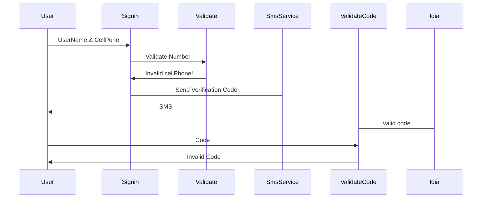

# Sending Verification Algorithm

Send Verification code via SMS  to you cellphone number

# Instructions
Create a .env file in the root  with:

    PORT=Express_port
    SECRET=Secret_session
    apiKey=Api_key_Nexmo
    apiSecret=Api_Secret_Nexmo
    company=Company_Name

Run with:

    npm run start

Please check the postman collection for example request

## UML diagrams

